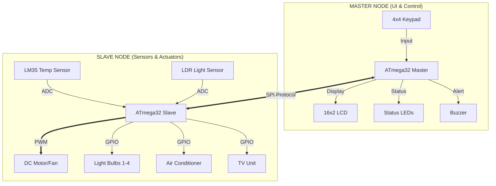
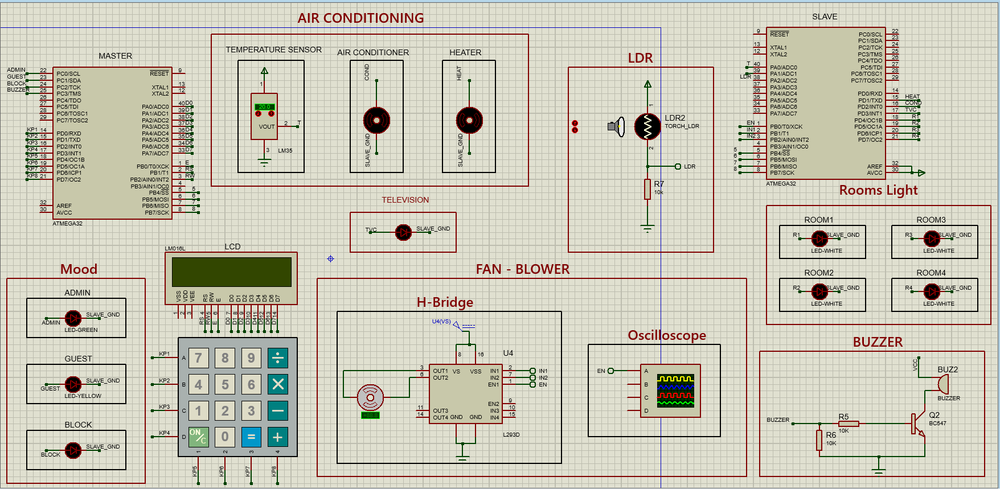

# 🏡 Smart Home Automation System

       

A professional, dual-microcontroller Smart Home system featuring **Master-Slave Architecture**, **Role-Based Access Control**, and **Automated Climate Logic**. This project demonstrates a production-grade embedded system design with layered architecture (MCAL/HAL/APP), robust communication protocols, and real-time sensor processing.

---

## 📑 Table of Contents
- [Project Overview](#-project-overview)
- [System Architecture](#-system-architecture)
- [Hardware Components](#-hardware-components)
- [Folder Structure](#-folder-structure-tree)
- [Simulation & Usage](#-simulation--usage)
- [How to Build & Run](#-how-to-build--run)
- [Features](#-features)
- [Drivers & Technical Documentation](#-drivers--technical-documentation)
- [Future Improvements](#-future-improvements)
- [License](#-license)
- [Author](#-author)

---

## 🚀 Project Overview

**📅 Architected and Deployed: December 2024**

### 🎯 Problem Statement
Legacy automation often suffers from monolithic design flaws, where user interface latency compromises real-time control. This project addresses these bottlenecks by engineering a **Decoupled Architecture**, splitting the Human-Machine Interface (HMI) from critical hardware execution. The primary objective was to design a fault-tolerant, **Distributed Ecosystem** capable of managing security and environmental logic without resource contention.

### 💡 Solution & Utility
The system implements a dual-node topology bridged by **Synchronous SPI Communication**:
1.  **Master Node (HMI Core):** Dedicated to high-level system orchestration, managing Role-Based Access Control (RBAC) and user command parsing.
2.  **Slave Node (Peripheral Controller):** Operates as a dedicated actuator hub, performing **Sensor Fusion** (Temperature/Light) and executing closed-loop control algorithms autonomously.

This division of labor ensures deterministic behavior, where the UI remains fluid while the Slave guarantees precise timing for PWM generation and sensor polling.

---

## 🏗 System Architecture

The software is built on a **Layered Architecture** to ensure portability and modularity:
-   **APP Layer:** Contains the main application logic, state machines, and menu systems.
-   **HAL (Hardware Abstraction Layer):** Abstracts external hardware (LCD, Keypad, Sensors) from the MCU.
-   **MCAL (Microcontroller Abstraction Layer):** Low-level drivers interacting directly with hardware registers (DIO, SPI, Timer, ADC).

### 📐 Block Diagram



---

## 🛠 Hardware Components

| Component | Quantity | Description | Function |
| :--- | :---: | :--- | :--- |
| **ATmega32** | 2 | 8-bit AVR Microcontroller | Main processing units (Master & Slave) |
| **LCD 16x2** | 1 | Alphanumeric Display | User Menu Interface |
| **Keypad** | 1 | 4x4 Matrix Keypad | User Input & Password Entry |
| **LM35** | 1 | Analog Temp Sensor | Measures room temperature |
| **LDR** | 1 | Light Dependent Resistor | Detects Day/Night cycles |
| **DC Motor** | 1 | 12V DC Motor | Fan / Blower functionality |
| **L293D/Relays** | - | Motor Driver / Switches | Driving high-power loads (Fan, Lights) |
| **LEDs** | 8+ | Status Indicators | Simulate Room Lights, AC, TV status |

---

## � Hardware Design & Schematics

The system design relies on a dual-MCU setup connected via SPI. Below is the Proteus simulation overview demonstrating the Master-Slave interaction.


*Figure 1: Proteus Simulation showing Master Node (Left) controlling the Slave Node (Right) via SPI, with virtual terminals and peripherals.*

### Pin Mapping Overview

#### Master Node (User Interface)
| Module | ATmega32 Pin | Function |
| :--- | :---: | :--- |
| **Keypad** | PORTD (0-7) | 4x4 Matrix Input |
| **LCD Data** | PORTA (0-7) | 8-bit Data Bus |
| **LCD Control** | PORTB (0-2) | EN(PB0), RS(PB1), RW(PB2) |
| **Status LEDs** | PORTC (0-2) | Admin(PC0), Guest(PC1), Block(PC2) |
| **Buzzer** | PC3 | Alarm Output |
| **SPI (Master)** | MOSI(PB5), MISO(PB6), SCK(PB7), SS(PB4) | Communication with Slave |

#### Slave Node (Actuators & Sensors)
| Module | ATmega32 Pin | Function |
| :--- | :---: | :--- |
| **Temperature Sensor** | PA0 (ADC0) | LM35 Input |
| **LDR Sensor** | PA1 (ADC1) | Light Level Input |
| **Fan (PWM)** | PB0 (EN), PB1-2 (Dir) | Software PWM & Motor Driver |
| **Room Lights** | PD4-PD7 | Relay/LED Control (Rooms 1-4) |
| **TV Unit** | PD3 | Switching Control |
| **Air Conditioner** | PD2 | Status LED / Relay |
| **Heater** | PD1 | Heating Element Relay |
| **SPI (Slave)** | MOSI(PB5), MISO(PB6), SCK(PB7), SS(PB4) | Communication with Master |

## 🧠 Deep System Logic & Technical Insight

### 1. System Lifecycle & Workflow
The system operates on a **Super-Loop architecture** with interrupt-driven background tasks (on the Slave node).

#### **Power-Up Sequence:**
1.  **Hardware Init:** both MCUs power up; Master initializes LCD, Keypad, SPI (Master Mode). Slave initializes ADC, SPI (Slave Mode), Timer0.
2.  **Handshake:** There is no specific startup handshake; the Master assumes the Slave is listening.
3.  **Idle State:**
    *   **Master:** Enters `Login Mode` awaiting user input.
    *   **Slave:** Enters `SPI Polling Loop` waiting for commands.

### 2. Communication Protocol (SPI)
The system uses a **synchronous, command-response** protocol over SPI.
*   **Mode:** Polling (Blocking).
*   **Clock Speed:** F_OSC / 16 (Prescaler).
*   **Frame Structure:**

| Direction | Byte 1 | Delay | Byte 2 |
| :--- | :--- | :--- | :--- |
| **Command** | `CMD_CODE` | 10-100ms | `DUMMY`/`ARG` |
| **Response** | `DEFAULT_ACK` | - | `STATUS`/`DATA` |

*   **Logic:**
    1.  Master sends `CMD_CODE`. Slave receives it in the main loop.
    2.  Master waits (software delay) to allow Slave to process.
    3.  Master sends a second byte (`DUMMY` or `ARGUMENT`) to clock out the Slave's response.
    4.  Slave receives the second byte and swaps it with the requested Data in the SPDR register.

### 3. Application State Machines

#### **Master Node (Control Plane)**
The Master application is an **Event-Driven State Machine** processing Keypad Inputs.
*   **States:** `NO_MODE` -> `ADMIN` | `GUEST` -> `MAIN_MENU` -> `SUB_MENUS`.
*   **Login Logic:**
    *   Input: Digits 0-9.
    *   Validation: Compares against stored `Adminpass` and `Gestpass` arrays.
    *   **Blocking Condition:** 3 wrong attempts trigger a `BLOCK_LED` and `Buzzer` loop for 20s. This is a blocking loop; no specific ISR is used, halting UI operations.

#### **Slave Node (Execution Plane)**
The Slave runs a **Hybrid Architecture**:
1.  **Foreground (Main Loop):**
    *   Dedicated to **SPI polling**. It blocks waiting for `SPIF` flag.
    *   Executes immediate commands (e.g., Toggle Relay).
2.  **Background (ISR - Timer0 Overflow):**
    *   **Frequency:** Runs every ~256 clock cycles (check prescaler).
    *   **Task 1: Software PWM:** Manages Fan speed (0-100% duty cycle) by toggling `PB0` based on a counter.
    *   **Task 2: Sensor polling:** Every ~150 overflows, it reads ADC (Temp/LDR) to update `auto_climate_active` logic.
    *   **Priority:** The ISR has higher priority, ensuring Fan control is smooth even if SPI communication is active.

### 4. Automated Control Algorithms
*   **Temperature Control:**
    *   *Hysteresis:* None explicitly coded, but logic separates heating (<10) and cooling (>25) thresholds broadly.
    *   *Fan Curve:* Linear interpolation: `Speed = (Temp - 30) * 10`. Maxes out at 40°C.
*   **Smart Lighting:**
    *   Uses `LDR` status. If Morning (`LDR > Threshold`), it aggressively turns off lights. If Night, it relies on user confirmation via Master.

---

## 🏗 Engineering-Level Documentation

### ⚠️ Assumptions & Constraints
1.  **Blocking SPI:** The Master's `_delay_ms` after sending a command is a critical timing constraint. If the Slave takes longer to process than the delay, data corruption occurs.
2.  **Volatile Memory:** Passwords are stored in RAM. A power cycle resets them to default (`0000`/`1111`).
3.  **Single-Tasking Master:** The Master cannot receive asynchronous alerts from the Slave (e.g., "Fire Detected"). It must polling "Get Status" to know state changes.

### ⚖️ Design Trade-offs
*   **Software PWM vs Hardware PWM:**
    *   *Choice:* Software PWM (ISR-based).
    *   *Reason:* Preserved hardware PWM pins (OC0) for other potential uses (SPI SS) or simple flexibility.
    *   *Trade-off:* Higher CPU load on Slave; potential jitter if interrupts are disabled for long periods.
*   **Polling SPI on Slave:**
    *   *Choice:* Blocking `SPI_ui8TransmitRecive` in `while(1)`.
    *   *Reason:* Simplicity. No need for complex ring buffers or interrupt handling for simple command processing.
    *   *Limitation:* Slave cannot do heavy main-loop processing without risking missing a command byte.

### ⏳ Performance Considerations
*   **UI Latency:** Keypad debouncing and SPI delays add up. Navigating menus feels "paced" (approx. 200-500ms response time).
*   **Sensor Response:** Temperature changes updates within ~30ms (ISR frequency), ensuring rapid response to overheating.

## 📂 Folder Structure Tree

```text
SmartHome/
├── code/
│   ├── SmartHomeMaster/      # Master Node Source Code
│   │   ├── APP/              # Main Logic, Menu System, Config
│   │   ├── HAL/              # LCD, Keypad, Buzzer, LED Drivers
│   │   ├── MCAL/             # DIO, SPI, Timer Drivers
│   │   └── LIB/              # Standard Macros & Types
│   ├── SmartHomeSlave/       # Slave Node Source Code
│   │   ├── APP/              # Automation Logic, Sensor Processing
│   │   ├── HAL/              # LED Driver
│   │   ├── MCAL/             # DIO, SPI, Timer, ADC Drivers
│   │   └── LIB/              # Standard Macros & Types
```

---

## 🎮 Simulation & Usage

This project is tailored for **Proteus Simulation** or real hardware deployment.

### Master Node Role
-   **Interface:** Displays a "Welcome" screen followed by a login prompt.
-   **Login:**
    -   **Admin (Default Pass: `0000`):** Full control over Rooms, AC, TV, Password Management.
    -   **Guest (Default Pass: `1111`):** Limited control (Room Lights only).
-   **Security:** If the password is entered incorrectly 3 times, the system enters **Block Mode for 20 seconds**, activating the alarm buzzer.

### Slave Node Role
-   **Actuation:** Listens for SPI commands to toggle pins (Lights, TV).
-   **Smart Mode (Morning/Night):**
    -   **Morning:** If LDR detects sunlight, all lights auto-OFF.
    -   **Night:** If LDR is dark, asks user "Turn Lights ON?".
-   **Climate Control (Background Logic):**
    -   **Temp < 10°C:** Heater ON.
    -   **Temp > 25°C:** AC ON.
    -   **Temp > 30°C:** Auto Fan ON (Speed increases with Temp).

---

## ⚙️ How to Build & Run

1.  **Clone the Repository:**
    ```bash
    git clone https://github.com/yourusername/SmartHome.git
    ```
2.  **Open in IDE:**
    -   Use Microchip Studio (formerly Atmel Studio) or Eclipse with AVR Plugin.
    -   Open `SmartHomeMaster.cproj` and `SmartHomeSlave.cproj`.
3.  **Build:**
    -   Select `Release` or `Debug` configuration.
    -   Build both projects to generate `.hex` files.
4.  **Simulate/Flash:**
    -   **Proteus:** Load `SmartHomeMaster.hex` into the first Atmega32 and `SmartHomeSlave.hex` into the second. Ensure Clock Frequency is set to **8MHz** (or as per `F_CPU` definition).
    -   **Hardware:** Use a USBASP or AVRISP programmer to flash the MCUs.

---

## ✨ Features

### 🔐 Security & Access Control
-   **Admin vs Guest Modes:** Differentiated menus and privileges.
-   **Password Management:** Admin can change both Admin and Guest passwords at runtime.
-   **Brute-force Protection:** 20-second system lockout + Alarm after 3 failed login attempts.

### 🌡️ Automated Climate Control
-   **Auto-AC:** Automatically engages cooling when temperature exceeds 25°C.
-   **Intelligent Fan:** Uses PWM to scale fan speed proportionally to temperature (30°C to 40°C range).
-   **Heater Safety:** Engages heating logic below 10°C to prevent freezing.

### 💡 Smart Lighting
-   **Day/Night Detection:** Uses LDR readings to suggest or automate lighting states.
-   **Energy Saving:** Auto-off feature during broad daylight.

---

## 📚 Drivers & Technical Documentation

### Driver Summary Table

| Driver | Layer | Description | Key Features |
| :--- | :---: | :--- | :--- |
| **DIO** | MCAL | Digital I/O | Pin direction/value control, internal pull-up support |
| **SPI** | MCAL | Serial Communication | Master/Slave config, Interrupt/Polling modes |
| **ADC** | MCAL | Analog-to-Digital | 10-bit resolution, Multi-channel reading |
| **Timer0** | MCAL | Timer/Counter | Fast PWM generation, Timebase for delays/events |
| **LCD** | HAL | Character LCD | 4-bit mode, Custom character generation |
| **Keypad** | HAL | Matrix Keypad | 4x4 Scanning, Debouncing logic |

---

### 1. SPI Communication Protocol
The system uses a custom command-response protocol over SPI.
-   **Master:** Sends 8-bit command codes (e.g., `ROOM1_TURN_ON` = `0x11`).
-   **Slave:** Acknowledges or returns requested data (e.g., Sensor Status).
-   **Timing:** Blocking transmission with small delays to ensure sync.

### 2. Timer & PWM (Slave)
-   **Mode:** Fast PWM (Timer0).
-   **Usage:** Controls Fan speed.
-   **Logic:**
    -   `Duty Cycle = (Temp - 30) * 10` (Linear scaling).
    -   Timer Overflow ISR (`TIMER0_OVF_vect`) handles Software PWM implementation for finer control.

### 3. ADC Driver (Slave)
-   **Resolution:** 10-bit (0-1023).
-   **Reference:** AVCC (5V).
-   **Channels:**
    -   Channel 0: LM35 Temperature Sensor (`Reading * 0.25` scaling factor applied).
    -   Channel 1: LDR Sensor (Threshold based logic).

### 4. Application Layer (State Machine)
-   **Menu System:** Implemented using a `switch-case` state machine (`menu.c`).
-   **Navigation:** `MAIN_MENU` -> `SUB_MENU` (e.g., `LIGHT_CONTROL_MENU`) -> `ACTION`.
-   **Input Handling:** Non-blocking keypad checks with timeout timers (`session_counter`).

---

## 🔮 Future Improvements
-   [ ] **EEPROM Storage:** Save passwords in non-volatile memory so they persist after power loss.
-   [ ] **UART/Bluetooth:** Add a Bluetooth module for control via Mobile App.
-   [ ] **RTOS Integration:** Port the Super-Loop architecture to FreeRTOS for better task scheduling.
-   [ ] **I2C EEPROM:** External storage for logging user activity.

---

## ⚖️ License
This project is licensed under the MIT License - see the [LICENSE](LICENSE) file for details.

---

## ✍ Author
**Abdelrahman Arafa**
-   **Role:** Mechatronics Engineer
-   **Email:** [engarafa55@gmail.com](mailto:engarafa55@gmail.com)

*Built with ❤️ and C.*

---
